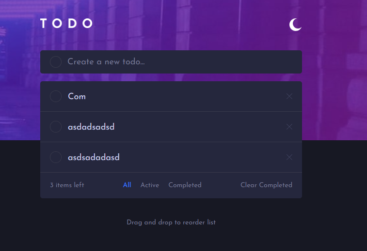
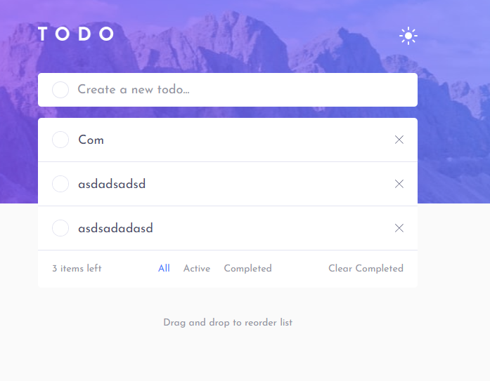

# Frontend Mentor - Workit landing page solution

This is a solution to the [Workit landing page challenge on Frontend Mentor](https://www.frontendmentor.io/challenges/workit-landing-page-2fYnyle5lu). Frontend Mentor challenges help you improve your coding skills by building realistic projects. 

## Table of contents

- [Overview](#overview)
  - [The challenge](#the-challenge)
  - [Screenshot](#screenshot)
  - [Links](#links)
- [My process](#my-process)
  - [Built with](#built-with)
  - [What I learned](#what-i-learned)
  - [Continued development](#continued-development)
- [Author](#author)

**Note: Delete this note and update the table of contents based on what sections you keep.**

## Overview

### The challenge

Users should be able to:

- View the optimal layout for the interface depending on their device's screen size
- See hover and focus states for all interactive elements on the page
- Create, delete and edit TODOS
- Change the order of TODOS by dragging and dropping.
- Switch between light and dark mode

### Screenshot

### Links

- Solution URL: [GitHub](https://github.com/jazzielp/todo-app)
- Live Site URL: [Web](https://jazzielp.github.io/todo-app/)

## My process

### Built with

- Semantic HTML5 markup
- Mobile-first workflow
- TypeScript - For type safety
- [React](https://reactjs.org/) - JS library
- [Vite](https://vitejs.dev/) - React framework
- [Tailwind](https://tailwindcss.com/) - For styles

### What I learned

- I learned to better handle useContext for state management.
- To type better with TypeScript.
- To be able to do a manual drag and drop without using a third-party library.

### Continued development

Continue learning Typescrip with React. Continue doing projects to increase the difficulty

## Author

- Website - [My porfolio](https://jazziel.dev)
- Frontend Mentor - [@jazzielp](https://www.frontendmentor.io/profile/jazzielp)
- X (Twitter) - [@hpuente06](https://www.twitter.com/hpuente06)